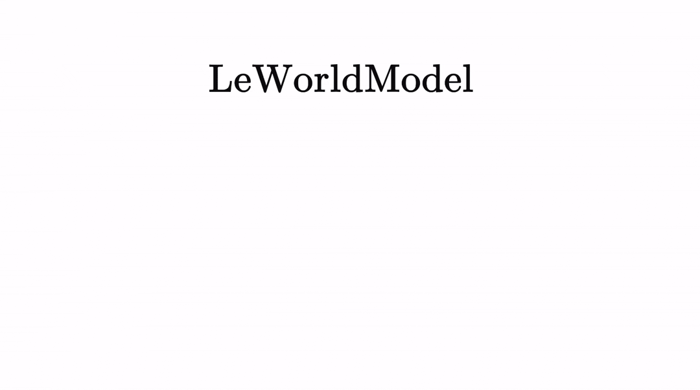

# LeWorldModel

## Stable End-to-End Joint-Embedding Predictive Architecture from Pixels

[Lucas Maes*](https://x.com/lucasmaes_), [Quentin Le Lidec*](https://quentinll.github.io/), [Damien Scieur](https://scholar.google.com/citations?user=hNscQzgAAAAJ&hl=fr), [Yann LeCun](https://yann.lecun.com/) and [Randall Balestriero](https://randallbalestriero.github.io/)

**Abstract:** Joint Embedding Predictive Architectures (JEPAs) offer a compelling framework for learning world models in compact latent spaces, yet existing methods remain fragile, relying on complex multi-term losses, exponential moving averages, pretrained encoders, or auxiliary supervision to avoid representation collapse. In this work, we introduce LeWorldModel (LeWM), the first JEPA that trains stably end-to-end from raw pixels using only two loss terms: a next-embedding prediction loss and a regularizer enforcing Gaussian-distributed latent embeddings. This reduces tunable loss hyperparameters from six to one compared to the only existing end-to-end alternative. With ~15M parameters trainable on a single GPU in a few hours, LeWM plans up to 48× faster than foundation-model-based world models while remaining competitive across diverse 2D and 3D control tasks. Beyond control, we show that LeWM's latent space encodes meaningful physical structure through probing of physical quantities. Surprise evaluation confirms that the model reliably detects physically implausible events.

<p align="center">
  <b>[ <a href="https://arxiv.org/pdf/2603.19312v1">Paper</a> | <a href="https://huggingface.co/collections/quentinll/lewm">Checkpoints &amp; Data</a> | <a href="https://le-wm.github.io/">Website</a> ]</b>
</p>

<br>

<p align="center">
  
</p>

If you find this code useful, please cite:

```bibtex
@article{maes_lelidec2026lewm,
  title={LeWorldModel: Stable End-to-End Joint-Embedding Predictive Architecture from Pixels},
  author={Maes, Lucas and Le Lidec, Quentin and Scieur, Damien and LeCun, Yann and Balestriero, Randall},
  journal={arXiv preprint},
  year={2026}
}
```

## Using the code

This repository builds on [stable-worldmodel](https://github.com/galilai-group/stable-worldmodel) for environment management, planning, and evaluation, and [stable-pretraining](https://github.com/galilai-group/stable-pretraining) for training.

### Installation

Install the upstream training and environment dependencies in an existing
environment, or follow the original lightweight setup:

```bash
uv venv --python=3.10
source .venv/bin/activate
uv pip install stable-worldmodel[train,env] memory-maze
```

The current checkout uses a Conda environment named `wm` and
[direnv](https://direnv.net/) to keep datasets, checkpoints, logs, and caches
below the repository:

```bash
cp .envrc.example .envrc  # skip when .envrc already exists
direnv allow
```

By default, `.envrc` sets:

```bash
STABLEWM_HOME=$PWD/data
SPT_CACHE_DIR=$STABLEWM_HOME/cache/stable-pretraining
MPLCONFIGDIR=$STABLEWM_HOME/cache/matplotlib
```

Edit `.envrc` before running `direnv allow` if large artifacts should live on a
different disk. FFmpeg must be available in `PATH` for H.264 validation-video
export.

## Data

Place downloaded datasets under `$STABLEWM_HOME/datasets`. Dataset names in the
Hydra configurations are resolved relative to that directory.

### Working-memory maze

This branch adds a partially observable color-cued maze for testing visual
working memory. Each episode presents three color cues, inserts a blank delay,
and then requires three decisions under a local `5 x 5` observation window:

- green: move forward;
- red: turn left;
- blue: turn right.

Generate and validate the default 64-frame dataset:

```bash
python generate_wm_maze.py --episodes 5000
python validate_wm_maze.py
```

The dataset is written to `$STABLEWM_HOME/datasets/wm_maze.h5`.
`validate_wm_maze.py` checks the HDF5 contract and exports an annotated H.264
video plus a frame-level CSV by default:

```bash
python validate_wm_maze.py --episode 12 --fps 4 --padding 24
python validate_wm_maze.py --no-video
```

## Training

`jepa.py` contains the LeWM model and `module.py` contains its predictor blocks.
Training is configured with Hydra under `config/train/`.

Train the working-memory maze model:

```bash
python train.py data=wm_maze
```

The scheduler retains the paper-style `max_epochs=100` horizon while
`stop_after_epoch=10` ends the run after epoch 10. Checkpoints are separated by
task:

```text
$STABLEWM_HOME/checkpoints/<task_name>/weights_epoch_<N>.pt
```

For the maze task, the selected checkpoint is:

```text
$STABLEWM_HOME/checkpoints/wm_maze/weights_epoch_10.pt
```

Validation runs once per epoch and exports the first validation sample to
`$STABLEWM_HOME/validation`. Videos contain cue and action targets, model
predictions, confidence values, phase labels, and decision correctness.

```yaml
validation_video:
  enabled: true
  every_n_epochs: 1
  fps: 4.0
  sample_index: 0
  padding: 128
```

Videos are encoded as H.264/yuv420p with fast-start metadata for browser and
VS Code compatibility. The outer canvas padding is white and does not resize
the maze observation.

## Evaluation

Evaluate cue memory and decision accuracy:

```bash
python eval_wm_maze.py \
  "$STABLEWM_HOME/checkpoints/wm_maze/weights_epoch_10.pt"
```

Export an annotated validation video from the same deterministic validation
split used during training:

```bash
python eval_wm_maze.py \
  "$STABLEWM_HOME/checkpoints/wm_maze/weights_epoch_10.pt" \
  --video-only
```

Use `--video-index` to select another validation sample and `--video-output` to
choose a different output filename.

## Planning

Evaluation configurations for the original control tasks live under
`config/eval/`. Set `policy` to the checkpoint path relative to
`$STABLEWM_HOME`, without the `_object.ckpt` suffix:

```bash
python eval.py --config-name=pusht.yaml policy=pusht/lewm
```

## Pretrained checkpoints

Official LeWM checkpoints and datasets are available from the
[Hugging Face collection](https://huggingface.co/collections/quentinll/lewm):

- [`quentinll/lewm-pusht`](https://huggingface.co/quentinll/lewm-pusht)
- [`quentinll/lewm-cube`](https://huggingface.co/quentinll/lewm-cube)
- [`quentinll/lewm-tworooms`](https://huggingface.co/quentinll/lewm-tworooms)
- [`quentinll/lewm-reacher`](https://huggingface.co/quentinll/lewm-reacher)

The full baseline checkpoint suite is available from the original
[Google Drive archive](https://drive.google.com/drive/folders/1r31os0d4-rR0mdHc7OlY_e5nh3XT4r4e).

For details on the working-memory modifications in this branch, see
[`docs/working-memory-maze-changes.md`](docs/working-memory-maze-changes.md).

## Contact & Contributions

Feel free to open [issues](https://github.com/lucas-maes/le-wm/issues). For
questions or collaborations, contact `lucas.maes@mila.quebec`.
